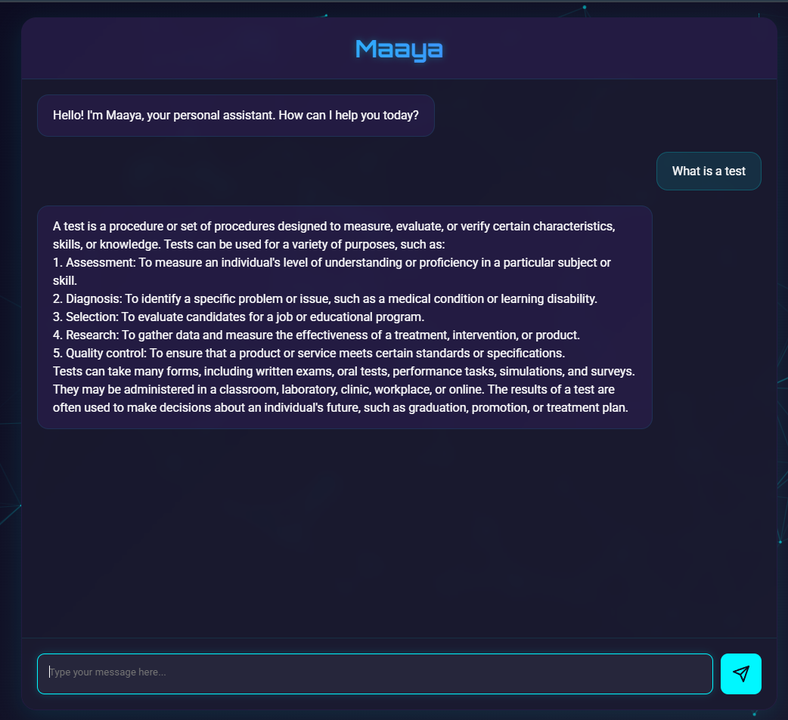
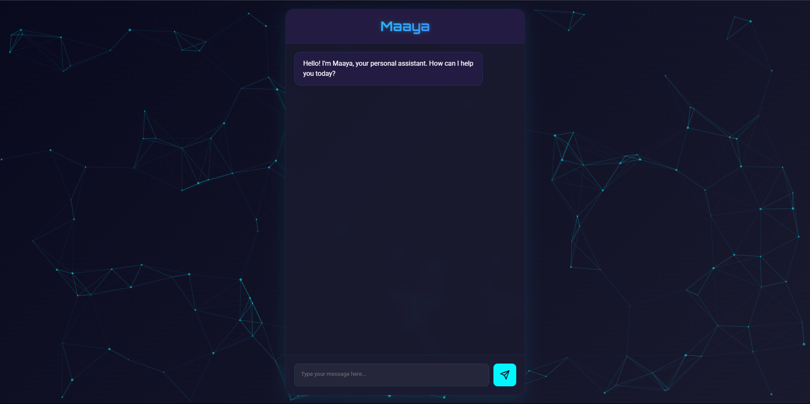

# 💬 Maaya — AI Chatbot Assistant

**Maaya** is a sleek and interactive AI chatbot web application powered by the **Mistral AI API**. It provides conversational assistance with a beautiful neon-themed interface, animated background, and dynamic message handling. Designed for both aesthetics and functionality, Maaya is your futuristic digital assistant for answering queries and carrying conversations with ease.

---

## 🌟 Features

- 🤖 **AI-Powered Conversations**
  - Uses the `mistral-tiny` model from Mistral AI to generate intelligent, context-aware responses.
  
- 🎨 **Neon Cyberpunk UI**
  - Stylish gradient text, dark-mode theme, and a glowing particles background for a modern and appealing chat interface.

- 🪄 **Smooth User Experience**
  - Auto-resizing input field
  - Formatted bot messages with line breaks
  - Scrollable and dynamic chat history

- 🔒 **API Integration**
  - Connects securely with Mistral API using bearer token (ensure to protect your API key!).

---

## 🖼️ Preview

---

## 🧠 Tech Stack

- **Frontend:** HTML5, CSS3, Vanilla JavaScript
- **AI Model:** [Mistral AI API](https://mistral.ai/)
- **Animation:** Particles.js

---

## 🤝 Contribution

Pull requests are welcome! If you’d like to suggest new features or improvements, feel free to open an issue.

---

## 📃 License

This project is open-source and free to use under the [MIT License](LICENSE).

---

## ✨ Created with ❤️ by Sanskar Singh

